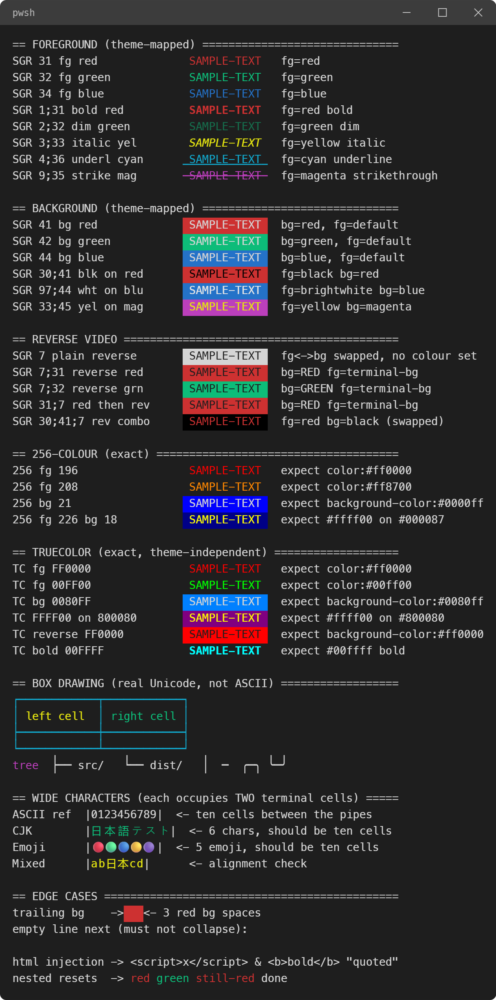
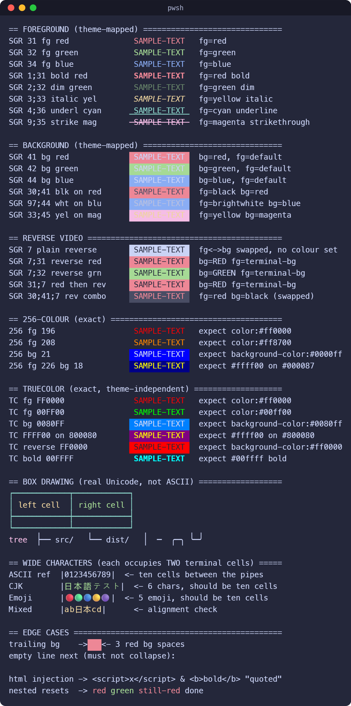

# Terminal screenshots that actually look like your terminal

[](https://github.com/Arelius-D/CLIsnap/releases) [](https://marketplace.visualstudio.com/items?itemName=arelius-d.clisnap) [](https://github.com/Arelius-D/CLIsnap/blob/main/LICENSE) [](#requirements) [](#output-formats) [](#footprint) [](#footprint)

Select output in the VS Code terminal, press a key, get an SVG, HTML or PNG.

**By default you get exactly what you were looking at.** Your theme's colors, your terminal's font, your operating system's window frame. CLIsnap does not ship a single palette or font of its own, so nothing is invented and nothing needs configuring. Everything past that point is yours to change if you want to: any theme you have installed, any window frame, any size.

 

The same capture twice. On the left, VS Code Dark with a Windows frame. On the right, Catppuccin Macchiato with a macOS frame. Neither is a CLIsnap theme; both came from the editor.

## Install

Search for **CLIsnap** in the Extensions view and click Install.

See [CHANGELOG.md](CHANGELOG.md).

## Capture and save

This is the everyday path. Two keys, one dialog, done.

1. Select the output you want in the integrated terminal.
2. Press the shortcut for your system.
3. Pick where to save it.

| System | Shortcut |
| --- | --- |
| Windows, Linux | `Ctrl+C, S` |
| macOS | `⌘C, S` |

Hold the modifier and press `C` then `S`. **C** for capture, **S** for save. It
is a chord because single-modifier combinations are already claimed by the
desktop or the terminal, and because it only engages while the terminal has
focus and text is selected, which is when `C` means copy rather than interrupt.

> [!NOTE]
> If you rebind it under **Keyboard Shortcuts**, that is a user keybinding and it
> overrides this default. With Settings Sync turned on it follows you to your
> other machines, so a shortcut you set on one computer can appear on another.

The shortcut only works while the terminal has focus and something is selected, so it never gets in the way anywhere else in the editor. Change it under **Keyboard Shortcuts** if you want a different key.

## Capture and adjust

When you want a different theme or frame on a particular shot:

1. Select the output.
2. **`Ctrl+Shift+P`** and run **CLIsnap: Capture and Preview**.
3. Change the theme, window frame or text size and watch the preview update.
4. Save as SVG, PNG or HTML, or copy the plain text.

Whatever you change here is remembered, so your next capture uses it. **Reset** puts everything back to how the capture was taken.

## Capturing long output

Scroll back and select as far as you want. CLIsnap captures the whole selection, not only the part on screen.

> [!IMPORTANT]
> The limit is your terminal's own scrollback, not CLIsnap. VS Code keeps 1000 lines by default, and anything older is already gone before you can select it. If you capture long logs, raise `terminal.integrated.scrollback`.

## Rendering a file

Some output is too long to select. A terminal only keeps the last 1000 lines by default, so anything older is gone before you can reach it. Send it to a file instead, and render the file.

1. Run your command, pointing its output at a file. Any command, any shell:

   ``` shell
   git log --oneline --graph -n 5000 > history.log
   ```

2. In VS Code, press **`Ctrl+Shift+P`** and run **CLIsnap: Render a Text File**.
3. Pick the file.

From there it behaves exactly like a terminal capture: same themes, same frames, same three formats.

Color is not read from the file yet. Escape codes in a log written with `--color=always` are stripped rather than shown, so you get clean text without control characters in it. Tabs are expanded to eight columns so tables still line up.

> [!NOTE]
> Progress bars read oddly. A tool that redraws a line in place writes every frame to the file, and CLIsnap does not replay the overwrites, so those frames end up next to each other on one line.

## Settings

| Setting | Default | What it does |
| --- | --- | --- |
| `clisnap.format` | `svg` | Format that the capture shortcut writes |
| `clisnap.frame` | `auto` | Window frame. `auto` follows your operating system |
| `clisnap.fontSize` | `14` | Text size of the output, in pixels |
| `clisnap.theme` | *(empty)* | Theme to render with. Empty means whichever theme is active |

## Output formats

**SVG** is the default and the one to reach for. It stays sharp at any size, and the text is real text, so you can open it in Inkscape or Illustrator and edit the words or recolor a line. Columns are pinned to their exact width, so tables and box drawing stay aligned even on a machine without your font.

**HTML** gives you a single self-contained file. The text stays live, so readers can select it, search it, or hear it read out by a screen reader.

**PNG** is rendered at 2x so it stays crisp on a high resolution display. Use it when whatever you are pasting into will not take anything else.

> [!NOTE]
> Setting `clisnap.format` to `png` makes the capture shortcut open the preview panel first, because turning the image into pixels needs a canvas to draw on.

## Themes

The theme list is every color theme installed in your editor, not a set of themes bundled with CLIsnap. Pick any of them and the capture is recoloured, so ANSI red becomes that theme's red.

Colors a program picked for itself, meaning 256 color and 24 bit values, are left exactly as they were. Those were never the theme's to change.

Your active theme is marked **· captured** in the list.

## Window frames

The frame around the output matches the operating system the shell is running on, so a Windows capture gets Windows caption buttons rather than macOS dots. Pick a different one in the preview, or turn the frame off entirely. The title is your terminal's own name, such as `pwsh`, `bash` or `zsh`.

## What gets captured

| What | How it comes out |
| --- | --- |
| Color | 16 color ANSI, 256 color and 24 bit, exactly as rendered |
| Attributes | bold, dim, italic, underline, strikethrough, reverse video |
| Layout | box drawing, tables and ASCII art keep their alignment |
| Wide characters | CJK and emoji take two cells, the same as in the terminal |
| Font | whatever your terminal was rendering with |

## Requirements

VS Code 1.93 or later.

> [!IMPORTANT]
> **On Linux you must install a clipboard tool.** A stock Ubuntu desktop ships none, and capture cannot work without one.
>
> ```shell
> sudo apt install xclip          # X11
> sudo apt install wl-clipboard   # Wayland
> ```
>
> This is needed on the machine running VS Code, not on a remote you are connected to.

Works in Remote-SSH, WSL and container windows. The capture reads your local clipboard and saves to your local filesystem, while the frame and title follow the machine the shell is on.

## Footprint

A 37 KB download, 81 KB installed, of which the extension itself is 43 KB and the icon 13 KB. No dependencies, no bundled runtime, no background process, no network access, nothing phoning home.

Rendering happens in the extension itself. SVG and HTML are text, so they are written straight out; PNG borrows the editor's own canvas to turn one into pixels. Nothing is uploaded and nothing is tunnelled anywhere.

## Known limits

**Integrated terminal only.** Capture uses VS Code's own terminal, so a separate terminal application cannot be captured.

**Nothing selected means nothing captured.** CLIsnap tells you rather than quietly saving whatever happened to be on your clipboard.

**PNG has a length limit that SVG and HTML do not.** Past a few thousand lines the canvas it draws on runs out of room. Save long captures as SVG or HTML.

**Long captures make large files.** 50,000 lines renders in under a second but produces roughly a 15 MB SVG, which is slow to open. HTML is about a third the size.

## Acknowledgements

Somewhat inspired by [termsnap](https://github.com/kushakjafry/termsnap) by [@kushakjafry](https://github.com/kushakjafry).
